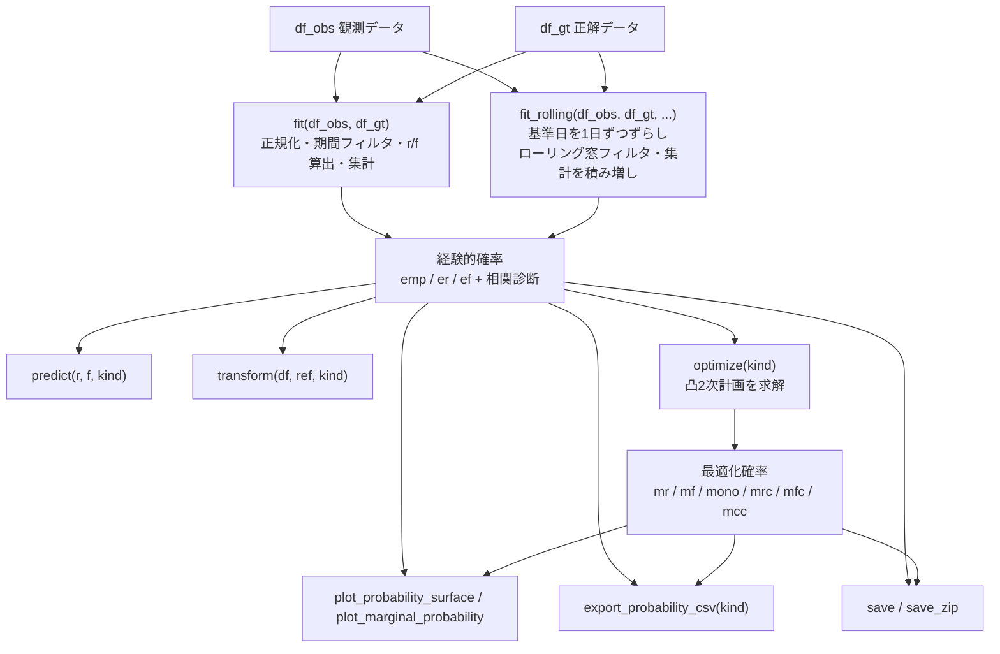

# 機能仕様書

## 概要

`rfscorer` は、ユーザー × 商品の行動履歴から商品の商品選択確率を推定する。  
推定には2段階のアプローチをとる。

1. **経験的商品選択確率の推定**: 観測期間に最新度 $r$、頻度 $f$ の商品が、正解期間で対象イベント（再閲覧・購買・CV など）を発生させる割合とする
2. **最適化商品選択確率の推定**: 経験的商品選択確率を用いて、RF 制約と最小二乗誤差を目的関数にもつ凸2次計画問題を解いて推定する

## 数理モデル

### 用語定義

| 記号 | 説明 |
|------|------|
| $U$ | ユーザーのリスト。$u$はユーザーを表す。 |
| $I$ | 商品のリスト。$i$は商品を表す。 |
| $R$ | 観測期間の最新度のリスト(1以上の連続自然数の集合)。$r$は最新度を表す。 |
| $F$ | 観測期間の頻度のリスト(1以上の連続自然数の集合)。$f$は頻度を表す。 |
| $n_{r,f}$ | 観測期間で最新度 $r$、頻度 $f$ の商品が正解期間で対象イベントを発生させた回数の合計 |
| $N_{r,f}$ | 観測期間で最新度 $r$、頻度 $f$ であった (user, item) ペアの数（=サンプル数） |
| $p_{r,f}$ | 観測期間で最新度 $r$、頻度 $f$ の商品の正解期間における経験的商品選択確率（2次元） |
| $p_r$ | 最新度 $r$ の1次元経験的商品選択確率（$f$ 方向に集約） |
| $p_f$ | 頻度 $f$ の1次元経験的商品選択確率（$r$ 方向に集約） |
| $x_{r,f}$ | 観測期間で最新度 $r$、頻度 $f$ の商品の正解期間における最適化商品選択確率 |

### 経験的商品選択確率の推定（`emp`）

「観測期間で最新度 $r$、頻度 $f$ の商品が正解期間で対象イベントを発生させた回数の合計」を
「観測期間で最新度 $r$、頻度 $f$ であった (user, item) ペアの数」で割った値を経験的商品選択確率とする。

$$p_{r,f} := \frac{n_{r,f}}{N_{r,f}}\ \ \  (r\in R, f\in F)$$

### 1次元経験的商品選択確率の推定（`er` / `ef`）

$p_{r,f}$ を一方の次元で集約した1次元確率を、`fit()` 呼び出し時に自動計算する。結果は1次元 dict / DataFrame として保持され、2次元グリッドへのブロードキャストは行わない。

- **`er`**（Empirical Recency）: 最新度 $r$ の1次元確率。
$$x_r = p_r\ \ \ (r\in R)$$
- **`ef`**（Empirical Frequency）: 頻度 $f$ の1次元確率。
$$x_f = p_f\ \ \ (f\in F)$$

### 最適化商品選択確率の推定

経験的商品選択確率を基準として、RF 制約を満たす最適化商品選択確率を求める。

#### 2次元最適化モデル（`mono` / `mrc` / `mfc` / `mcc`）

経験的商品選択確率 $p_{r,f}$ を目標として、(r, f) グリッド全体で最適化する。

**共通制約（単調性）**
すべてのモデルに適用する。`eps=0.0`（デフォルト）の場合は広義単調性、`eps > 0` の場合は狭義単調性となり隣接値の差が $\varepsilon$ 以上になる。

- **Recency 制約**: 最近接触した商品ほど商品選択確率が高い。
$$x_{r,f} \geq x_{r+1,f} + \varepsilon\ \ \ (r, r+1 \in R,\ f \in F)$$
- **Frequency 制約**: 商品への接触が多いほど商品選択確率が高い。
$$x_{r,f} + \varepsilon \leq x_{r,f+1}\ \ \ (r \in R,\ f, f+1 \in F)$$

$\varepsilon = 0$ のとき広義単調性（$\geq$）、$\varepsilon > 0$ のとき狭義単調性。$\varepsilon$ の上限は $\max(p_{r,f}) / (\lvert R\rvert - 1)$ および $\max(p_{r,f}) / (\lvert F\rvert - 1)$ の小さい方の値とする。

**追加制約（凹凸性）**

| モデル | Recency 凸性 | Frequency 凹性 |
|--------|:-----------:|:-------------:|
| `mono` | — | — |
| `mrc`  | ✓ | — |
| `mfc`  | — | ✓ |
| `mcc`  | ✓ | ✓ |

- **Recency 凸性**（`mrc`・`mcc`）: 最近接触した商品ほど商品選択確率の落ち幅が大きい。
$$x_{r,f} - 2x_{r+1,f} + x_{r+2,f} \geq 0\ \ \ (r, r+1, r+2 \in R)$$
- **Frequency 凹性**（`mfc`・`mcc`）: 商品への接触が多いほど商品選択確率の上昇幅が小さい。
$$x_{r,f} - 2x_{r,f+1} + x_{r,f+2} \leq 0\ \ \ (f, f+1, f+2 \in F)$$

**目的関数（共通）**
$$\sum_{r\in R, f\in F} N_{r,f} \cdot(p_{r,f} - x_{r,f})^2$$

#### 1次元最適化モデル（`mr` / `mf`）

1次元経験的確率 $p_r$・$p_f$ を目標として1次元で最適化する。結果は1次元 dict に格納される。

- **`mr`**（Monotonic Recency）: $r$ 方向の単調性と凸性を同時に制約。
  - 変数: $x_r\ (r \in R)$
  - 単調性: $x_r \geq x_{r+1} + \varepsilon\ \ \ (r, r+1 \in R)$
  - 凸性: $x_r - 2x_{r+1} + x_{r+2} \geq 0$
  - 目的関数: $\sum_{r \in R} N_r \cdot (p_r - x_r)^2$
  - $\varepsilon$ の上限: $\max(p_r) / (\lvert R\rvert - 1)$

- **`mf`**（Monotonic Frequency）: $f$ 方向の単調性と凹性を同時に制約。
  - 変数: $x_f\ (f \in F)$
  - 単調性: $x_f + \varepsilon \leq x_{f+1}\ \ \ (f, f+1 \in F)$
  - 凹性: $x_f - 2x_{f+1} + x_{f+2} \leq 0$
  - 目的関数: $\sum_{f \in F} N_f \cdot (p_f - x_f)^2$
  - $\varepsilon$ の上限: $\max(p_f) / (\lvert F\rvert - 1)$


## クラス仕様

### `RecencyFrequencyScorer`

#### コンストラクタ

```python
RecencyFrequencyScorer(user_col="user", item_col="item", time_col="datetime", recency_mode="day", recency_unit=1)
```

| パラメータ | 型 | デフォルト | 説明 |
|-----------|-----|-----------|------|
| `user_col` | `str` | `"user"` | ユーザー識別子のカラム名 |
| `item_col` | `str` | `"item"` | 商品識別子のカラム名 |
| `time_col` | `str` | `"datetime"` | 時点カラムのカラム名（`datetime64`・文字列・整数いずれも可） |
| `recency_mode` | `str` | `"day"` | 最新度の算出方式。`"day"`: 基準日からの経過日数ビン `(ref - last_view) // recency_unit + 1`。`"view"`: ユーザー内で最終閲覧 timestamp が新しい順の 1 起算ランク（1 = 最新）。`ref`・`recency_unit` は無視 |
| `recency_unit` | `int` | `1` | 最新度（recency 軸）のビン幅（正の整数）。`recency_unit=7` で週単位、`recency_unit=30` で月単位（近似）。`recency_mode="view"` 時は無視 |

##### `recency_mode` の補足

- **`"view"`（view recency）** は **timestamp の完全な解像度**で順位付けする（同一日内の時・分・秒も区別）。内部表現の日序数は同一日を区別できないため、view モードでは時刻を保持した高解像度キーを併走させて順位付けする。同一キー（完全一致）の場合のみ入力データ上の初出順でタイブレークする。
- recency/frequency の計算ロジックは `_recency.py`（`build_day_rf` / `build_view_rf`）に分離され、`fit()` / `fit_rolling()` / `transform()` のいずれでも `recency_mode` に従う。`fit_rolling()` の観測窓・正解窓フィルタは日単位のまま（窓選択は日、view 順位は各窓内でフル解像度キーから算出）。
- **将来拡張**: `recency_mode="session"`（セッション単位順位）、`frequency_mode`（既定 `"view"` = 閲覧イベント数。`"day"` = 閲覧日数 = 日序数の `nunique`。`recency_mode`・高解像度キーと直交）、frequency 軸のビン幅 `frequency_unit` を想定。既定が非対称（recency=`"day"` / frequency=`"view"`）なのは、古典的 RF で recency が時間ベース・frequency が回数ベースであることに由来する。

#### メソッド

##### `fit(df_obs, df_gt, ref=None, recency_limit=None, frequency_limit=None)`

観測データ DataFrame と正解データ DataFrame を直接受け取り、$(r, f)$ 別の経験的商品選択確率を推定する。scikit-learn スタイルの主要 fit メソッド。

| パラメータ | 型 | デフォルト | 説明 |
|-----------|-----|-----------|------|
| `df_obs` | `pd.DataFrame` | — | 観測期間の行動履歴 |
| `df_gt` | `pd.DataFrame` | — | 正解期間のイベント履歴（閲覧・購買・CV など推定対象のイベント） |
| `ref` | `str \| datetime \| int \| None` | `None` | 最新度計算の基準値（日付または整数）。`None` の場合は `df_obs[time_col].max()` を使用。`recency_mode="view"` 時は無視 |
| `recency_limit` | `int \| None` | `None` | 最大最新度。`None` の場合、累積対象イベント発生数の分布から `RECENCY_LIMIT_RATE` に基づいて自動決定 |
| `frequency_limit` | `int \| None` | `None` | 最大頻度。`None` の場合、累積対象イベント発生数の分布から `FREQUENCY_LIMIT_RATE` に基づいて自動決定 |

戻り値: `self`

> `fit()` / `fit_rolling()` を呼ぶと、経験的確率を再計算するとともに過去の `optimize()` 結果（`mono_*` / `mr_*` / `mf_*` / `mrc_*` / `mfc_*` / `mcc_*`）を `None` にリセットする。再フィット後に最適化確率を使う場合は `optimize()` を再実行する。

##### `fit_rolling(df_obs, df_gt, observation_days, gt_days, roll_days=1, end_date=None, recency_limit=None, frequency_limit=None, time_col=None)`

分割点（基準日）を1日ずつ過去にずらしながら複数基準日で集計を積み増し、$(r, f)$ 別の経験的商品選択確率を推定する（ローリング集計）。サンプル数を増やして経験的確率を安定化し、基準日固有の偏り（曜日性など）を平滑化する。

`df_obs`（観測ログ）と `df_gt`（正解ログ）は別々に受け取るため、`df_gt` の対象イベントは再閲覧だけでなく購買・CV など `df_obs` と別種のイベントでもよい。各ロールで観測窓は `df_obs` から、正解窓は `df_gt` から独立に切り出す。同一ログを使う（再閲覧）場合は `fit_rolling(df, df, ...)` と同じ DataFrame を両方に渡す。`fit()` と異なり、ロールごとに正解窓を切るため **`df_gt` にも `time_col` が必須**となる。

| パラメータ | 型 | デフォルト | 説明 |
|-----------|-----|-----------|------|
| `df_obs` | `pd.DataFrame` | — | 観測イベントの行動履歴（接触）。`time_col` 必須 |
| `df_gt` | `pd.DataFrame` | — | 正解イベントの履歴（再閲覧・購買・CV など）。`time_col` 必須 |
| `observation_days` | `int` | — | 観測期間の長さ（time_col の単位）。各ロールの観測窓幅 |
| `gt_days` | `int` | — | 正解期間の長さ（time_col の単位）。各ロールの正解窓幅 |
| `roll_days` | `int` | `1` | ローリング回数。`1` で単一スナップショット。`N` で起点〜起点$-(N-1)$ の N 基準日を集計 |
| `end_date` | `str \| datetime \| int \| None` | `None` | 使用する正解データの最終日。`None` の場合は `df_gt[time_col]` の最大値を使用。最新ロールの分割点（anchor）は `end_date - gt_days` |
| `recency_limit` | `int \| None` | `None` | 最大最新度。`None` の場合、全ロール集計後のプールから自動決定 |
| `frequency_limit` | `int \| None` | `None` | 最大頻度。`None` の場合、全ロール集計後のプールから自動決定 |
| `time_col` | `str \| None` | `None` | 時点カラム名。省略時は `__init__` の値。`df_obs`・`df_gt` 双方に適用 |

各ロール `k`（`0 ≤ k < roll_days`）で分割点 `td = anchor - k`（過去方向）とし、観測窓 `[td - observation_days + 1, td]`・正解窓 `[td + 1, td + gt_days]` を切り出して集計を積み増す。集計開始前に、最古ロールが完全な観測窓を確保できない場合は `ValueError`（確保可能な最大 `roll_days` を提示）、`end_date` が正解データ最終日を超える場合も `ValueError` を送出する（fail-fast）。

戻り値: `self`。`fit()` と同一の属性（`emp_probability_` 等）を生成し、後続の `predict` / `transform` / `optimize` / `plot_*` をそのまま利用できる。

##### `predict(r, f, kind="emp")`

指定した最新度 $r$・頻度 $f$ の商品選択確率を返す。

| パラメータ | 型 | デフォルト | 説明 |
|-----------|-----|-----------|------|
| `r` | `int` | — | 最新度（1が最も直近、数値が大きいほど古い。1以上） |
| `f` | `int` | — | 頻度（観測期間の接触回数。1以上） |
| `kind` | `str` | `"emp"` | `"emp"`・`"er"`・`"ef"`・`"mono"`・`"mr"`・`"mf"`・`"mrc"`・`"mfc"`・`"mcc"` のいずれか（長名エイリアスも使用可） |

戻り値: `float`

##### `transform(df, ref=None, kind="emp", user_col=None, item_col=None, time_col=None)`

入力 DataFrame の各 user×item ペアに最新度・頻度・商品選択確率・順位を付与して返す。scikit-learn スタイルの主要 transform メソッド。

| パラメータ | 型 | デフォルト | 説明 |
|-----------|-----|-----------|------|
| `df` | `pd.DataFrame` | — | スコアリング対象の行動履歴（観測期間でフィルタ済みを想定） |
| `ref` | `str \| datetime \| int \| None` | `None` | 最新度・頻度の計算基準値（日付または整数）。`None` の場合は `df[time_col].max()` を使用。`recency_mode="view"` 時は無視 |
| `kind` | `str` | `"emp"` | `"emp"`・`"er"`・`"ef"`・`"mono"`・`"mr"`・`"mf"`・`"mrc"`・`"mfc"`・`"mcc"` のいずれか（長名エイリアスも使用可） |
| `user_col` | `str \| None` | `None` | ユーザーカラム名。省略時は `__init__` で設定した値を使用 |
| `item_col` | `str \| None` | `None` | 商品カラム名。省略時は `__init__` で設定した値を使用 |
| `time_col` | `str \| None` | `None` | 時点カラム名。省略時は `__init__` で設定した値を使用 |

戻り値: `pd.DataFrame`。ユーザー・商品カラム名は `__init__`（または引数の上書き）で設定した名前になる。その他のカラム: `recency`, `frequency`, `probability`, `order`

##### `evaluate(df_rec, df_gt, order=1, user_col=None, item_col=None)`

推薦結果と正解期間のイベント履歴を比較し、各順位カットオフでの評価指標を返す。
`df_rec` の user/item 列と `df_gt` の user/item 列は内部で `str` にキャストして比較する。

| パラメータ | 型 | デフォルト | 説明 |
|-----------|-----|-----------|------|
| `df_rec` | `pd.DataFrame` | — | `transform()` の出力 |
| `df_gt` | `pd.DataFrame` | — | 正解期間のイベント履歴（閲覧・購買・CV など）。`fit()` に渡したものと同じ DataFrame を渡すことを想定 |
| `order` | `int` | `1` | 評価する最大推薦順位 |
| `user_col` | `str \| None` | `None` | ユーザーカラム名。省略時は `__init__` で設定した値を使用 |
| `item_col` | `str \| None` | `None` | 商品カラム名。省略時は `__init__` で設定した値を使用 |

戻り値: `pd.DataFrame`（カラム: `order`, `n_recommended`, `n_hit`, `precision`, `recall`, `f1`, `recall_norm`, `f1_norm`）

##### `optimize(kind="mono", eps=0.0, verbose=False)`

RF 制約を満たし、経験的商品選択確率との誤差を最小化する最適化商品選択確率を推定する。`fit()` 後に呼び出す。
内部で `optimizer.py` の `RecencyFrequencyOptimizer` を使用して凸2次計画問題を解く。
結果は `kind` に対応する属性（例: `mr_probability_*`、`mono_probability_*`）に格納されるため、複数モデルの結果を同時に保持できる。

| パラメータ | 型 | デフォルト | 説明 |
|-----------|-----|-----------|------|
| `kind` | `str` | `"mono"` | `"mr"`（Recency 1次元・単調性 + 凸性）・`"mf"`（Frequency 1次元・単調性 + 凹性）・`"mono"`（2次元・単調性のみ）・`"mrc"`（2次元・単調性 + Recency 凸性）・`"mfc"`（2次元・単調性 + Frequency 凹性）・`"mcc"`（2次元・単調性 + Recency 凸性 + Frequency 凹性）のいずれか（長名エイリアスも使用可） |
| `eps` | `float` | `0.0` | 単調性制約における隣接値の最小差 $\varepsilon$。`0.0`（デフォルト）のとき広義単調性。正の値を指定すると狭義単調性となり、同一 recency または frequency で確率値が一致しなくなる。上限はデータから自動計算され、超過すると `ValueError` |
| `verbose` | `bool` | `False` | `True` の場合、最適化計算のソルバー情報（終了ステータス、目的関数値、経過時間、変数数、制約数）を標準出力に表示する |

戻り値: `None`

##### `export_probability_csv(kind="emp", path=None)`

商品選択確率を CSV ファイルに書き出す。

| パラメータ | 型 | デフォルト | 説明 |
|-----------|-----|-----------|------|
| `kind` | `str` | `"emp"` | `"emp"`・`"er"`・`"ef"`・`"mono"`・`"mr"`・`"mf"`・`"mrc"`・`"mfc"`・`"mcc"`・`"all"` のいずれか（長名エイリアスも使用可）。`"all"` は9モデルをマージして出力（カラム: `recency`, `frequency`, `N`, `cv`, `emp_probability`, `er_probability`, `ef_probability`, `mono_probability`, `mr_probability`, `mf_probability`, `mrc_probability`, `mfc_probability`, `mcc_probability`） |
| `path` | `str \| None` | `None` | 出力先。`None` の場合カレントディレクトリに `probability_{kind}.csv` を出力。ディレクトリを指定した場合はそのディレクトリにデフォルトファイル名で出力。ファイルパスを指定した場合はそのパスに直接出力 |

戻り値: なし

##### `plot_probability_surface(kind="emp", title=None, figsize=(6, 5), fontsize=12, recency_label="recency", frequency_label="frequency", probability_label="probability", path=None)`

商品選択確率を3次元ワイヤーフレームで可視化し、`matplotlib.figure.Figure` を返す。

Jupyter Lab / Colab では返り値がそのままインライン描画される。
ファイルに保存する場合は `fig.savefig("output.png")` を呼ぶか `path` パラメータを使用する。
日本語軸ラベルを使用する場合は `pip install rfscorer[ja]` で `japanize-matplotlib` を導入する。

| パラメータ | 型 | デフォルト | 説明 |
|-----------|-----|-----------|------|
| `kind` | `str` | `"emp"` | `"emp"`・`"mono"`・`"mrc"`・`"mfc"`・`"mcc"` のいずれか（長名エイリアスも使用可）。`"mr"`・`"mf"`・`"er"`・`"ef"` は1次元モデルのため `ValueError` を送出する（`plot_marginal_probability()` を使用する） |
| `title` | `str \| None` | `None` | 図のタイトル。`None` の場合は kind に基づくデフォルトタイトル（例: `"Empirical"`）を表示。タイトルを非表示にするには `""` を渡す |
| `figsize` | `tuple[float, float]` | `(6, 5)` | 図のサイズ（インチ）。論文用途では最終印刷サイズに合わせる |
| `fontsize` | `int` | `12` | 軸ラベル・目盛りのフォントサイズ。論文用途では対象ジャーナルの本文サイズ（通常 8〜10 pt）に合わせる |
| `recency_label` | `str` | `"recency"` | x 軸（最新度）のラベル |
| `frequency_label` | `str` | `"frequency"` | y 軸（頻度）のラベル |
| `probability_label` | `str` | `"probability"` | z 軸（確率）のラベル |
| `path` | `str \| None` | `None` | 保存先。`None` の場合は保存しない。ディレクトリを指定した場合は `surface_{kind}_probability.png` として保存。ファイルパスを指定した場合はそのパスに直接保存 |

戻り値: `matplotlib.figure.Figure`

##### `plot_marginal_probability(kind="er", title=None, figsize=(5, 4), fontsize=12, axis_label=None, probability_label="probability", path=None)`

最新度または頻度の一方向の商品選択確率を折れ線グラフで可視化し、`matplotlib.figure.Figure` を返す。
プロット軸（最新度・頻度）は `kind` から自動推定される（`"er"`・`"mr"`・`"rboth"` → 最新度軸、`"ef"`・`"mf"`・`"fboth"` → 頻度軸）。
経験的商品選択確率と1次元最適化商品選択確率を重ねて表示できる（`"rboth"`・`"fboth"`）。

Jupyter Lab / Colab では返り値がそのままインライン描画される。
ファイルに保存する場合は `fig.savefig("output.png")` を呼ぶか `path` パラメータを使用する。
日本語軸ラベルを使用する場合は `pip install rfscorer[ja]` で `japanize-matplotlib` を導入する。

| パラメータ | 型 | デフォルト | 説明 |
|-----------|-----|-----------|------|
| `kind` | `str` | `"er"` | `"er"`（最新度方向の経験的確率のみ）・`"ef"`（頻度方向の経験的確率のみ）・`"mr"`（最新度方向の最適化確率のみ）・`"mf"`（頻度方向の最適化確率のみ）・`"rboth"`（経験的 + 最適化を最新度軸に重ねて表示）・`"fboth"`（経験的 + 最適化を頻度軸に重ねて表示）のいずれか（長名エイリアスも使用可） |
| `title` | `str \| None` | `None` | 図のタイトル。`None` の場合は kind に基づくデフォルトタイトル（例: `"Empirical Recency"`）を表示。タイトルを非表示にするには `""` を渡す |
| `figsize` | `tuple[float, float]` | `(5, 4)` | 図のサイズ（インチ）。論文用途では最終印刷サイズに合わせる |
| `fontsize` | `int` | `12` | 軸ラベル・目盛りのフォントサイズ。論文用途では対象ジャーナルの本文サイズ（通常 8〜10 pt）に合わせる |
| `axis_label` | `str \| None` | `None` | x 軸のラベル。`None` の場合は最新度軸に `"recency"`、頻度軸に `"frequency"` を使用 |
| `probability_label` | `str` | `"probability"` | y 軸（確率）のラベル |
| `path` | `str \| None` | `None` | 保存先。`None` の場合は保存しない。ディレクトリを指定した場合は `marginal_{kind}_probability.png` として保存。ファイルパスを指定した場合はそのパスに直接保存 |

線スタイル: `"rboth"`・`"fboth"` のとき経験的が実線・最適化が破線。単独表示のときは実線。すべて黒色。

戻り値: `matplotlib.figure.Figure`

##### `save(path=None)`

`fit()` / `optimize()` 後のインスタンスを pickle 形式でファイルに保存する。

| パラメータ | 型 | デフォルト | 説明 |
|-----------|-----|-----------|------|
| `path` | `str \| Path \| None` | `None` | 保存先。`None` の場合カレントディレクトリに `rfscorer.pkl` を保存。ディレクトリを指定した場合はそのディレクトリ内に `rfscorer.pkl` として保存。ファイルパスを指定した場合はそのパスに直接保存 |

戻り値: なし

##### `load(path)` （クラスメソッド）

`save()` で保存したファイルからインスタンスを復元する。

| パラメータ | 型 | デフォルト | 説明 |
|-----------|-----|-----------|------|
| `path` | `str \| Path` | — | ロードするファイルパス |

戻り値: `RecencyFrequencyScorer`

バージョンのメジャー・マイナーが異なる場合は `UserWarning` を出してロードを続行する。pickle を使用するため、信頼できないソースのファイルはロードしないこと。

##### `save_zip(path=None)`

`fit()` / `optimize()` 後のインスタンスを zip アーカイブとして保存する。zip 内には以下が含まれる。

- `rfscorer.pkl` — モデル本体（`load_zip()` はここから復元）
- `metadata.json` — バージョン・パラメータ・統計情報（`rfscorer_version`, `user_col`, `item_col`, `time_col`, `recency_mode`, `recency_unit`, `recency_limit`, `frequency_limit`, `observation_start`, `observation_end`, `fit_method`, `roll_days`, `observation_days`, `gt_days`, `n_obs_rows`, `n_gt_events`, `n_users`, `n_items`, `record_num`, `total_cv`, `optimized_kinds`）
- `probabilities/` — 計算済みの各モデルの確率テーブル CSV（`emp_probability.csv`, `er_probability.csv`, `ef_probability.csv`, および `optimize()` 済みのモデル分）
- `plots/` — 計算済みの各モデルの確率グラフ PNG（2D モデルは `plot_probability_surface()` の出力、1D モデルは `plot_marginal_probability()` の出力）

| パラメータ | 型 | デフォルト | 説明 |
|-----------|-----|-----------|------|
| `path` | `str \| Path \| None` | `None` | 保存先。`None` の場合カレントディレクトリに `scorer.zip` を保存。ディレクトリを指定した場合はそのディレクトリ内に `scorer.zip` として保存。ファイルパスを指定した場合はそのパスに直接保存 |

戻り値: なし

##### `load_zip(path)` （クラスメソッド）

`save_zip()` で保存した zip アーカイブからインスタンスを復元する。

| パラメータ | 型 | デフォルト | 説明 |
|-----------|-----|-----------|------|
| `path` | `str \| Path` | — | ロードする zip ファイルのパス |

戻り値: `RecencyFrequencyScorer`

バージョンのメジャー・マイナーが異なる場合は `UserWarning` を出してロードを続行する。pickle を使用するため、信頼できないソースのファイルはロードしないこと。

##### `show()`

`fit()` / `fit_rolling()` 後の状態を構造化された診断レポートとして標準出力に表示する。以下の4セクションで構成される。

- **Data**: データセット規模（物理ユニーク: 観測行数・正解イベント数・ユーザ数・商品数）・観測期間・user×item ペア数・対象イベント数（フィルタ前後）。`fit_rolling()` 後は正解期間・ローリング構成・延べレコード数（pooled）の行を追加表示し、user×item ペア数・対象イベント数には「pooled over rolls」を明示
- **Model**: `recency_mode`・`recency_limit`・`frequency_limit`
- **Correlation**: スピアマン相関係数・p 値・重み付き相関係数・スライス別相関係数
- **Empirical Probability Table**: 経験的商品選択確率の横持ちテーブル

戻り値: なし

#### 属性

| 属性 | 型 | 説明 | 利用可能なタイミング |
|------|-----|------|-----------------|
| `recency_limit` | `int` | 最新度の上限値 | `fit()` 後 |
| `frequency_limit` | `int` | 頻度の上限値 | `fit()` 後 |
| `emp_probability_` | `pd.DataFrame` | 経験的商品選択確率（カラム: `recency`, `frequency`, `N`, `cv`, `probability`） | `fit()` 後 |
| `emp_probability_table_` | `pd.DataFrame` | 経験的商品選択確率（横持ち。インデックス: `recency`、カラム: `frequency`） | `fit()` 後 |
| `emp_probability_dict_` | `dict` | 経験的商品選択確率（キー: `(r, f)`、値: `probability`） | `fit()` 後 |
| `recency_corr_` | `float \| None` | 等重みスピアマン ρ（最新度 $r$ と周辺確率 $p_r$ の相関）。期待符号: 負（最近ほど高確率） | `fit()` 後 |
| `recency_corr_pvalue_` | `float \| None` | `recency_corr_` の p 値（両側検定） | `fit()` 後 |
| `frequency_corr_` | `float \| None` | 等重みスピアマン ρ（頻度 $f$ と周辺確率 $p_f$ の相関）。期待符号: 正（多いほど高確率） | `fit()` 後 |
| `frequency_corr_pvalue_` | `float \| None` | `frequency_corr_` の p 値（両側検定） | `fit()` 後 |
| `recency_corr_weighted_` | `float \| None` | $N_r$ 重み付きスピアマン ρ（最新度 $r$ と周辺確率 $p_r$ の加重相関） | `fit()` 後 |
| `frequency_corr_weighted_` | `float \| None` | $N_f$ 重み付きスピアマン ρ（頻度 $f$ と周辺確率 $p_f$ の加重相関） | `fit()` 後 |
| `recency_slice_corr_` | `dict[int, float] \| None` | スライス別 $N$ 重み付きスピアマン ρ（固定 $r$ ごとに corr($f$, $p_{r,f}$) を $N_{r,f}$ 重みで算出）。期待符号: 正 | `fit()` 後 |
| `frequency_slice_corr_` | `dict[int, float] \| None` | スライス別 $N$ 重み付きスピアマン ρ（固定 $f$ ごとに corr($r$, $p_{r,f}$) を $N_{r,f}$ 重みで算出）。期待符号: 負 | `fit()` 後 |
| `er_probability_` | `pd.DataFrame` | er モデル1次元経験的商品選択確率（最新度のみ。ブロードキャストなし）（カラム: `recency`, `probability`） | `fit()` 後 |
| `er_probability_dict_` | `dict` | er モデル1次元経験的商品選択確率（キー: `r`（int）、値: `probability`） | `fit()` 後 |
| `ef_probability_` | `pd.DataFrame` | ef モデル1次元経験的商品選択確率（頻度のみ。ブロードキャストなし）（カラム: `frequency`, `probability`） | `fit()` 後 |
| `ef_probability_dict_` | `dict` | ef モデル1次元経験的商品選択確率（キー: `f`（int）、値: `probability`） | `fit()` 後 |
| `mr_probability_` | `pd.DataFrame` | mr モデル1次元最適化商品選択確率（カラム: `recency`, `probability`） | `optimize(kind="mr")` 後 |
| `mr_probability_dict_` | `dict` | mr モデル最適化商品選択確率（キー: `r`（int）、値: `probability`） | `optimize(kind="mr")` 後 |
| `mf_probability_` | `pd.DataFrame` | mf モデル1次元最適化商品選択確率（カラム: `frequency`, `probability`） | `optimize(kind="mf")` 後 |
| `mf_probability_dict_` | `dict` | mf モデル最適化商品選択確率（キー: `f`（int）、値: `probability`） | `optimize(kind="mf")` 後 |
| `mono_probability_` | `pd.DataFrame` | mono モデル最適化商品選択確率（カラム: `recency`, `frequency`, `probability`） | `optimize(kind="mono")` 後 |
| `mono_probability_table_` | `pd.DataFrame` | mono モデル最適化商品選択確率（横持ち） | `optimize(kind="mono")` 後 |
| `mono_probability_dict_` | `dict` | mono モデル最適化商品選択確率（キー: `(r, f)`、値: `probability`） | `optimize(kind="mono")` 後 |
| `mrc_probability_` | `pd.DataFrame` | mrc モデル最適化商品選択確率（カラム: `recency`, `frequency`, `probability`） | `optimize(kind="mrc")` 後 |
| `mrc_probability_table_` | `pd.DataFrame` | mrc モデル最適化商品選択確率（横持ち） | `optimize(kind="mrc")` 後 |
| `mrc_probability_dict_` | `dict` | mrc モデル最適化商品選択確率（キー: `(r, f)`、値: `probability`） | `optimize(kind="mrc")` 後 |
| `mfc_probability_` | `pd.DataFrame` | mfc モデル最適化商品選択確率（カラム: `recency`, `frequency`, `probability`） | `optimize(kind="mfc")` 後 |
| `mfc_probability_table_` | `pd.DataFrame` | mfc モデル最適化商品選択確率（横持ち） | `optimize(kind="mfc")` 後 |
| `mfc_probability_dict_` | `dict` | mfc モデル最適化商品選択確率（キー: `(r, f)`、値: `probability`） | `optimize(kind="mfc")` 後 |
| `mcc_probability_` | `pd.DataFrame` | mcc モデル最適化商品選択確率（カラム: `recency`, `frequency`, `probability`） | `optimize(kind="mcc")` 後 |
| `mcc_probability_table_` | `pd.DataFrame` | mcc モデル最適化商品選択確率（横持ち） | `optimize(kind="mcc")` 後 |
| `mcc_probability_dict_` | `dict` | mcc モデル最適化商品選択確率（キー: `(r, f)`、値: `probability`） | `optimize(kind="mcc")` 後 |
| `record_num` | `int` | 全行動履歴のレコード数（実効サンプル。`fit_rolling()` では延べ） | `fit()` 後 |
| `record_num_obs` | `int` | 観測期間のレコード数（実効サンプル。`fit_rolling()` では延べ） | `fit()` 後 |
| `record_num_gt` | `int` | 正解期間のレコード数（実効サンプル。`fit_rolling()` では延べ） | `fit()` 後 |
| `record_num_target_org` | `int` | フィルタリング前の分析対象レコード数（実効サンプル。`fit_rolling()` では延べ） | `fit()` 後 |
| `record_num_target` | `int` | フィルタリング後の分析対象レコード数（実効サンプル。`fit_rolling()` では延べ） | `fit()` 後 |
| `total_cv_org` | `int` | フィルタリング前の cv 数（実効サンプル。`fit_rolling()` では延べ） | `fit()` 後 |
| `total_cv` | `int` | フィルタリング後の cv 数（実効サンプル。`fit_rolling()` では延べ） | `fit()` 後 |
| `n_obs_rows_` | `int` | 観測ログの物理ユニーク行数（データセット規模。`fit_rolling()` では観測和集合区間で重複なく計数） | `fit()` 後 |
| `n_gt_events_` | `int` | 正解ログの物理ユニークイベント数（データセット規模。`fit_rolling()` では正解和集合区間で重複なく計数） | `fit()` 後 |
| `n_users_` | `int` | 観測ログのユニークユーザ数（`fit_rolling()` では観測和集合区間） | `fit()` 後 |
| `n_items_` | `int` | 観測ログのユニーク商品数（`fit_rolling()` では観測和集合区間） | `fit()` 後 |
| `fit_method_` | `str` | 学習方法（`"fit"` / `"fit_rolling"`） | `fit()` 後 |
| `roll_days_` | `int` | ロール数（`fit()` では `1`、`fit_rolling()` では指定値） | `fit()` 後 |
| `observation_days_` | `int \| None` | 観測窓幅（`fit()` では `None`、`fit_rolling()` では指定値） | `fit()` 後 |
| `gt_days_` | `int \| None` | 正解窓幅（`fit()` では `None`、`fit_rolling()` では指定値） | `fit()` 後 |

> **タイミング欄の補足**: 「`fit()` 後」と記載した経験的確率・相関診断・統計属性は `fit_rolling()` 後にも同様に生成される（`fit_rolling()` は内部で `fit()` と同一の集計部を使用する）。`record_num_*` / `total_cv*` は実効サンプルサイズ（推定の分母）で、`fit_rolling()` では全ロール集計後の**延べ合算値**となる（重なるロールで物理行が複数回計数される）。データセットの実規模（論文記載用）は物理ユニーク件数 `n_obs_rows_` / `n_gt_events_` / `n_users_` / `n_items_` を参照する（`fit()` では両者は一致、`fit_rolling()` で初めて乖離する）。`observation_end_` は最新ロールの分割点（anchor）、`observation_start_` は最古ロールの観測開始日（観測和集合 `[observation_start_, observation_end_]`）。正解和集合は `observation_end_ - roll_days_ + 2` 〜 `observation_end_ + gt_days_`（`show()` の ground truth 行・`n_gt_events_` の計数範囲はこれ）。`anchor` / `end_date` は別属性として保持せず、`observation_end_` と `gt_days_` / `roll_days_` から導出する。

## ユーティリティ

### `split_by_date(df, target_date, observation_days, gt_days, time_col="datetime")`

`from rfscorer import split_by_date` で利用可能。`target_date` を基準に単一の DataFrame を観測データ・正解データに分割するスタンドアロン関数。`RecencyFrequencyScorer` に依存せず、ローリング workflow など複数 `target_date` を渡す研究的用途にも利用できる。

- 観測期間: `max(df の time_col 最小値, target_date - observation_days + 1 タイムステップ)` 〜 `target_date`（含む。`observation_days=N` で N タイムステップの窓。タイムステップの単位は `time_col` の型に依存する（日付型なら日単位、整数型なら整数ステップ））
- 正解期間: `target_date の翌時点` 〜 `min(df の time_col 最大値, target_date + gt_days タイムステップ)`（`gt_days=N` で N タイムステップの窓）

| パラメータ | 型 | デフォルト | 説明 |
|-----------|-----|-----------|------|
| `df` | `pd.DataFrame` | — | 分割対象の DataFrame |
| `target_date` | `str \| datetime \| int` | — | 観測期間と正解期間の分割点（日付または整数） |
| `observation_days` | `int \| None` | — | `target_date` から遡る最大タイムステップ数。`None` の場合は df の先頭まで |
| `gt_days` | `int \| None` | — | `target_date` から進む最大タイムステップ数。`None` の場合は df の末尾まで |
| `time_col` | `str` | `"datetime"` | 時点カラム名 |

戻り値: `tuple[pd.DataFrame, pd.DataFrame]`（`(df_obs, df_gt)`）。元の df の構造を保持したサブセット。

## データフロー

`df_obs` / `df_gt` は `split_by_date(df, target_date, observation_days, gt_days)` で分割することもできる。


